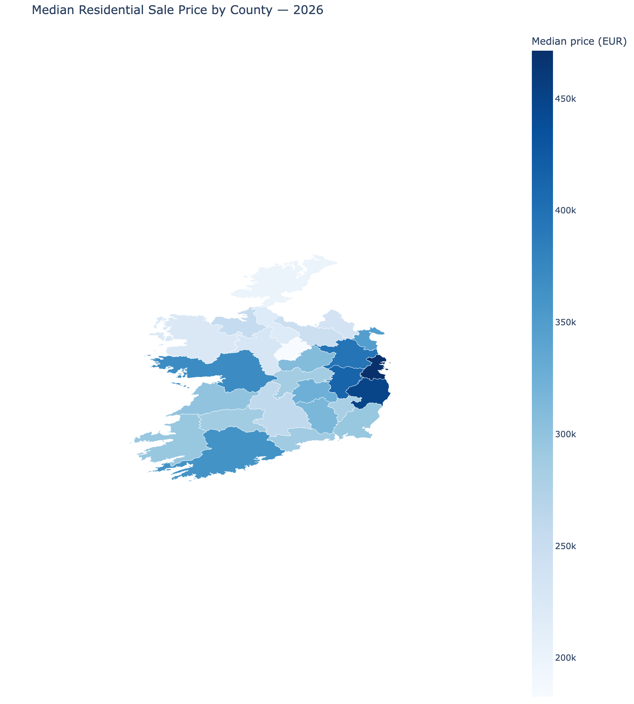
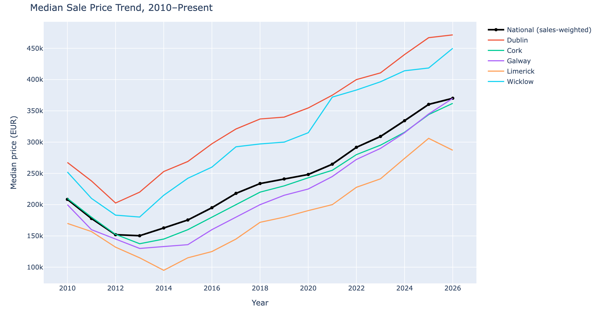

# Irish Residential Property Price Analysis

Analysis of every residential property sale registered in Ireland since 2010, using the
official **Property Price Register** — understanding what drives price differences
across counties, and building a simple, honest predictive model.

**Status: complete (Day 1–2).**

## Data source

[Property Price Register](https://www.propertypriceregister.ie/) — Ireland's official
register of residential property sales, published by the Property Services Regulatory
Authority. Free, no login, full history CSV download. **795,347 rows** (2010–2026).

The raw file is **not committed to this repo** (108MB). To reproduce: download the full
CSV from the link above and place it at `data/raw/PPR-ALL.csv`.

## Dashboard




An interactive version (hover for exact figures) is at [`dashboard/dashboard.html`](dashboard/dashboard.html) — open it in any browser, no server needed.

> **Note on tooling:** this dashboard was originally scoped for Power BI, but Power BI
> Desktop is Windows-only and unavailable on macOS. It's built with **Plotly** instead,
> covering the same three views (choropleth, trend, per-county detail via hover/legend
> toggle). The underlying data (`data/clean/county_year_summary.csv`) is plain CSV, so
> it would import into Power BI directly if built on Windows later.

## What's in this repo

| Path | Contents |
|---|---|
| `notebook/clean_data.py` | Cleans the raw PPR export into an analysis-ready dataset |
| `notebook/load_to_postgres.py` | Loads the cleaned data into a local Postgres database |
| `notebook/model_price_prediction.py` | Trains and evaluates the price prediction models |
| `notebook/build_dashboard.py` | Builds the county choropleth + trend dashboard |
| `notebook/model_results.json` | Saved model metrics and feature importances |
| `sql/01_yoy_change_by_county.sql` | Year-over-year price change by county (CTE + `LAG` window function) |
| `sql/02_rolling_median_price.sql` | Rolling 4-quarter median price by county (`AVG() OVER` window frame) |
| `sql/03_county_growth_ranking.sql` | Counties ranked by total price growth since 2010 (`RANK()`) |
| `data/clean/properties_sample.csv` | 10,000-row random sample of the cleaned data |
| `data/clean/county_year_summary.csv` | Median/mean price and sale count by county and year |
| `data/clean/properties_clean.csv` | Full cleaned dataset, 795k rows (gitignored — regenerate locally) |
| `data/geo/ireland_counties_26.geojson` | County boundaries, dissolved to the 26 traditional counties |
| `dashboard/` | Dashboard HTML + PNG screenshots |

## Cleaning steps (`notebook/clean_data.py`)

- Parsed dates (`dd/mm/yyyy`) and derived year/quarter
- Stripped the currency symbol and thousands separators from price, cast to float
- Normalized county names (casing/whitespace)
- Validated Eircodes with a regex — invalid/blank values are set to null rather than kept as garbage strings
- Converted `Not Full Market Price` and `VAT Exclusive` from Yes/No text to booleans
- **Flagged** (not silently deleted) 27,411 statistical outliers using an IQR rule on log-transformed price, and 40,518 sales marked "Not Full Market Price" — both kept in the dataset with a boolean flag so downstream analysis can choose to include or exclude them
- Added a log-price column (raw price is heavily right-skewed)

## SQL analysis

Three queries in `sql/`, run against a local Postgres 18 instance:

1. **YoY change by county** — median price per county per year, compared to the prior year with `LAG()`.
2. **Rolling 4-quarter median** — smooths quarterly noise using a window frame (`ROWS BETWEEN 3 PRECEDING AND CURRENT ROW`), not a self-join.
3. **County growth ranking** — total % growth from each county's first to most recent year, ranked with `RANK()`. Westmeath and Laois top the list (+112%), Longford and Donegal the least (+42–45%).

All three exclude rows flagged as price outliers.

## Price prediction model (`notebook/model_price_prediction.py`)

Predicts **log(price)** from **county, property type, and year** only — deliberately
simple, since the PPR export has no property size, condition, or BER data.

| Model | R² | MAE (EUR) |
|---|---|---|
| Linear Regression | 0.404 | €106,798 |
| Random Forest | 0.419 | €105,002 |

**Top features (Random Forest):** county = Dublin (41%), sale year (37%), county =
Wicklow (4%), property type = New Dwelling (4%), county = Kildare (4%).

**Read this honestly:** an R² around 0.42 means county and year alone explain under
half of price variation — expected, since the single biggest driver of a house's price
(its size and condition) isn't in this dataset at all. The model is a genuine reflection
of what these three fields alone can tell you, not a valuation tool.

## Reproduce locally

```bash
python3 -m venv venv && source venv/bin/activate
pip install -r requirements.txt
cp .env.example .env   # then edit .env with your local Postgres password

python notebook/clean_data.py
python notebook/load_to_postgres.py
python notebook/model_price_prediction.py
python notebook/build_dashboard.py
```

## Known limitations

- Price is the *registered sale price* — it doesn't capture property size/condition/BER, so any model built on this data alone has real limits (see above).
- "Not Full Market Price" sales (e.g. transfers between relatives) are flagged and excluded from the SQL analysis and model, but kept (flagged) in the full cleaned dataset.
- Eircode coverage in the source data is sparse; county-level analysis is more reliable than Eircode-level.
- County boundaries come from a third-party GeoJSON source (not an official OSi boundary file) and are simplified for file size — fine for this dashboard's resolution, not for precise GIS work.
